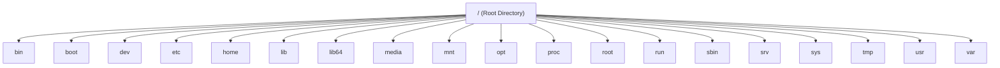

# 🚀 Day 1 – Introduction to DevOps

---

## 📌 1. Introduction to DevOps

DevOps is a **culture, mindset, and set of practices** that brings Development (Dev) and Operations (Ops) teams together to deliver software faster, more reliably, and continuously.

---

### 🔑 Key Principles of DevOps

- 🤝 **Collaboration** – Breaking silos between development, operations, and other teams.
- ⚙️ **Automation** – Automating repetitive tasks to reduce human error.
- 🔄 **Continuous Integration & Continuous Deployment (CI/CD)** – Frequent integration of code and automated deployment.
- 📊 **Monitoring & Feedback** – Real-time monitoring to quickly identify and fix issues.

---

### ✅ Benefits of DevOps

- 🚀 Faster time to market  
- 🤝 Improved collaboration and communication  
- 🛠 Higher software quality  
- 📈 Enhanced scalability and reliability  

---

## 🏢 2. How an IT Company Works

Understanding how an IT company functions helps in understanding the role of DevOps.

---

### 🔄 General Workflow

#### 📍 Project Initiation
- Requirement gathering
- Feasibility study
- Budget allocation

#### 💻 Development
- Coding by developers
- Regular commits to version control systems (e.g., Git)

#### 🧪 Testing
- Automated and manual testing
- Identifying and fixing bugs

#### 🚀 Deployment
- Releasing software to production
- Ensuring high availability and minimal downtime

#### 🔧 Maintenance
- Monitoring performance
- Applying updates and patches

---

### 🏢 Key Departments

| Team | Responsibility |
|------|---------------|
| 👨‍💻 Development Team | Builds the application |
| 🧪 Testing Team (QA) | Ensures software quality |
| ⚙️ Operations Team | Manages infrastructure and deployment |
| 📊 Business Team | Engages with clients and stakeholders |

---

## 💻 3. What is an Application?

An application is a software program designed to perform specific tasks for users or systems.

---

### 📱 Types of Applications

- 🌐 **Web Applications** – Accessible via browsers (e.g., Gmail, Facebook)
- 📱 **Mobile Applications** – For smartphones (e.g., WhatsApp, Instagram)
- 🖥 **Desktop Applications** – Installed on computers (e.g., MS Word, Photoshop)
- 🧩 **Microservices** – Modular applications with independent components

---

### 🏗 Key Components of an Application

- 🎨 **Frontend** – User Interface (UI)
- ⚙️ **Backend** – Server-side logic
- 🗄 **Database** – Stores application data

---

## 👨‍💻 4. Developers vs Testers vs DevOps

### 🔍 Roles and Responsibilities

| Role | Responsibilities |
|------|------------------|
| 👨‍💻 Developers | - Write application code <br> - Fix bugs and add features |
| 🧪 Testers | - Perform functional & performance testing <br> - Report issues |
| 🚀 DevOps | - Manage CI/CD pipelines <br> - Automate infrastructure <br> - Monitor production systems |

---

### 🎯 Key Differences

#### 🔎 Focus
- Developers → Writing code  
- Testers → Validating software quality  
- DevOps → Bridging development & operations  

#### 🛠 Tools Used

| Role | Tools |
|------|------|
| Developers | IDEs, Git, Debugging tools |
| Testers | Selenium, JUnit, LoadRunner |
| DevOps | Jenkins, Docker, Kubernetes, Terraform |

---

## 🎯 Conclusion

DevOps plays a crucial role in modern IT companies by enabling smooth collaboration and faster software delivery.

Understanding:
- How IT companies work  
- What applications are  
- Roles of Developers, Testers, and DevOps Engineers is essential for every aspiring DevOps professional.

---


# 🚀 Day 2: The Strategic Imperative of DevOps

---

## 🐧 Top Features of Linux

Linux is an **open-source operating system** mainly used on servers, cloud, DevOps, and production systems.

---

## 🔑 Key Features (with Examples)

### 🆓 Open Source
- Source code is free  
- Anyone can modify it  
👉 Example: Google, Amazon, Facebook customize Linux for their systems  

---

### 🔐 Secure
- Very few viruses  
- Strong file permission system (rwx)  
👉 Example: Banks & cloud servers run on Linux  

---

### 🏗 Stable
- Servers run months/years without restart  
👉 Example: Amazon servers don’t reboot daily like Windows  

---

### 👥 Multi-user & Multi-tasking
- Multiple users can work at the same time  
👉 Example: 100 developers logged into one Linux server  

---

### 💻 Command-line Power
- Automation using shell scripts  
👉 Example: Backup script running every night  

---

## 🎯 Interactive Question
👉 **Why do you think companies prefer Linux over Windows for servers?**

---

## 🌍 Linux Everywhere
- Powers over 90% of cloud infrastructure  
- Used in supercomputers, IoT devices, and embedded systems  
- Essential for DevOps environments  

### Examples:
- 📱 Mobile → Android  
- ☁ Cloud → AWS, GCP, Azure  
- 🖥 Servers → Websites, APIs  
- ⚙ DevOps Tools → Docker, Kubernetes  

---

## 🚀 Unlocking Linux Careers
- Proficiency in Linux opens doors to roles in:
  - System Administration  
  - Linux Administrator  
  - DevOps Engineer  
  - Cloud Engineer  
- High demand for Linux skills across industries  

⚠ Linux is **NOT optional** if you want cloud or DevOps jobs.

---

# ☁ Why AWS Stands Out in the Cloud Market

- Market leader with a broad range of services  
- Exceptional scalability and reliability  
- Comprehensive global infrastructure  

---

## 🏆 Why AWS is #1

- First cloud provider  
- Largest market share  
- Trusted by startups & enterprises  

---

## 🔎 Key Reasons

- Global infrastructure  
- Pay-as-you-go model  
- Highly secure  
- Huge service ecosystem  

---

## 📦 Overview of AWS

- Provides compute, storage, networking, and database services  
- Popular services: EC2, S3, RDS, Lambda  
- Pay-as-you-go pricing model  

💡 Instead of buying a ₹5 lakh server, you rent a server for ₹10/hour.

---

# 🌟 Customer Success Stories

### 🎬 Netflix
Scalable streaming platform  

### 🚀 NASA
Data storage and processing  

---

## ❗ Problem Netflix Faced

- Millions of users  
- Different countries  
- Peak traffic at night & weekends  
- Traditional servers cannot scale fast  

### Example:
On Friday night at 9 PM, suddenly 1 million people press PLAY 😳  
If servers are limited → app crashes.

---

## ✅ How AWS Helped Netflix

Netflix moved fully to AWS:

- EC2 → Run streaming services  
- S3 → Store video content  
- Auto Scaling → Add servers automatically  
- CloudFront → Fast video delivery worldwide  

---

## 🔄 What Happens in Real Time

1. User clicks Play  
2. AWS checks nearest server  
3. Video streams from closest location  
4. If traffic increases → AWS adds more servers  

---

## 💡 Key Learning for Students

AWS allows automatic scaling without manual work.

👉 **What would happen if Netflix used only 5 physical servers?**

---

# 📈 Scalability and Flexibility of Business with AWS

- Elastic scaling to meet demand  
- Supports diverse workloads and applications  
- Enables rapid deployment of new features  

---

# ⚖ Comparing AWS with Competitors

| Provider | Strength |
|----------|----------|
| AWS | Largest service catalog and global reach |
| Azure | Strong integration with Microsoft products |
| Google Cloud | Focus on data analytics and AI |

---

# 🚀 Why DevOps is a Growing Career Field

- Organizations prioritize faster software delivery and innovation  
- Essential for modern software development practices  

---

## 🏗 Old Model
Developer → throws code  
Ops → deploys manually  
Slow & error-prone  

---

## ⚡ DevOps Model
- Automation  
- Faster releases  
- Reliable systems  

---

# 📊 High Demand for DevOps Professionals

- Roles in automation, CI/CD, and infrastructure management  
- Every company wants faster delivery  
- Automation saves money  
- Cloud adoption increasing  

---

# 💰 Salary Expectations and Career Growth

- Competitive salaries globally  
- Opportunities for leadership roles  

---

# 🛠 Skills and Expertise in DevOps

- Proficiency in CI/CD tools  
- Strong scripting knowledge  
- Cloud platforms expertise  
- Infrastructure and configuration management  

---

# 🎓 Certifications and Learning Resources

## 🏆 Certifications
- AWS Certified DevOps Engineer  
- Kubernetes Certified Administrator  
- Linux Foundation Certified Engineer  

---

## 📚 Resources
- Online platforms: Coursera, Udemy, Pluralsight  
- Books:
  - *The Phoenix Project*  
  - *The DevOps Handbook*  

---

# 🔮 The Future of DevOps Careers

- Increased adoption of automation and AI  
- Enhanced demand for containerization and orchestration experts  

---

# 🎯 Goal to Achieve in CDEC

- Master core Linux and DevOps tools  
- Implement real-world DevOps projects  
- Achieve certifications to validate expertise  

---

# 🐧 Day 3: Navigating the Linux Landscape


---

# 📚 Getting Started with Operating Systems

An **Operating System (OS)** is the backbone of any computer.  
It manages hardware and software resources and allows users to interact with the system.

---

# 🖥️ Types of Operating Systems

### 🏠 Desktop OS
- Windows  
- macOS  
- Linux  

### 🖧 Server OS
- Ubuntu Server  
- CentOS  
- Windows Server  

### 📱 Mobile OS
- Android  
- iOS  

### 📟 Embedded OS
Designed for specific devices such as:
- IoT devices  
- Routers  

---

# 🌍 How Operating Systems Impact Daily Life

Operating systems power:

- Personal computers
- Mobile devices
- Servers
- Internet browsing
- Gaming
- Productivity tools

---

## 📊 OS Activities Table

| Activity | OS Role |
|-----------|----------|
| Internet browsing | Runs browser |
| Gaming | Manages CPU & RAM |
| Video calls | Controls mic & camera |
| Office work | Runs applications |
| Mobile apps | Manages background apps |

---

# ⚖️ Windows vs Unix vs Linux

## 🏢 Ownership & Origin

- **Windows** → Proprietary OS developed by Microsoft  
- **Unix** → Developed in the 1970s; foundation for many OS  
- **Linux** → Open-source Unix-like OS created by Linus Torvalds  

---

## 💰 Cost & Licensing

| OS | Licensing |
|----|------------|
| Windows | Paid license |
| Unix | Licensed, often expensive |
| Linux | Free & open-source |

---

## 🔐 Security & Privacy

- Windows → Frequent malware target  
- Unix/Linux → Strong security features; widely trusted  

---

## 🖼️ User Interface

| OS | Interface Style |
|----|----------------|
| Windows | GUI-focused |
| Unix/Linux | Command-line driven (GUI optional) |

---

# 🖥️ What is a Server?

A **server** is a computer that provides services to other computers over a network.

---

# 🖥️ Desktop OS vs Server OS

| Feature | Desktop OS | Server OS |
|----------|------------|------------|
| Purpose | Personal use | Network services |
| Optimization | Multimedia & UI | Performance & stability |
| Usage | Home/Office | Data centers |

---

# 🐧 Introduction to Linux

Linux is a versatile operating system used in:

- Servers
- Desktops
- Embedded systems

It is known for:

- Stability
- Security
- Flexibility

---

# 🏗️ Architecture of Linux

1. **Kernel** → Core of the OS (manages hardware)
2. **System Libraries** → Provide system functionality
3. **System Utilities** → Management tools
4. **Shell** → Command interface
5. **Applications** → User software

---

# 💻 Understanding the Linux Prompt

Example:  [root@localhost ~]#

| Symbol | Meaning |
|--------|----------|
| root | Current login username |
| localhost | Machine name / hostname |
| ~ | Current working directory |
| # | Root user |
| $ | Normal/local user |

---

# 🛠️ Linux Basic Commands

## 👤 User & Session Commands

| Command | Description |
|----------|------------|
| tty | Show current terminal number |
| who | Show logged-in users |
| whoami | Show current username |
| logout / exit / Ctrl + D | Logout user |
| sudo -i | Switch to root user |

---

## 📂 File & Directory Commands

| Command | Description |
|----------|------------|
| pwd | Present working directory |
| cd | Change directory |
| ls | List files |
| ll | Detailed file listing |
| cat | View file content |
| clear | Clear terminal screen |

---

## 📅 Date & Calendar Commands

| Command | Description |
|----------|------------|
| cal | Current month calendar |
| cal <year> | Show full year calendar |
| cal -3 | Previous, current, next month |
| cal -j <year> | Julian calendar |
| date | Show current date & time |

---

## 🔄 System Control Commands

| Command | Description |
|----------|------------|
| reboot / init 6 | Restart system |
| poweroff / init 0 | Power off |
| shutdown | Shutdown after 1 min |
| shutdown -h now | Immediate shutdown |
| shutdown -c | Cancel shutdown |
| hostname | Show machine name |

---

# 📊 Commands to View System Information

| Command | Description |
|----------|------------|
| hostnamectl | Detailed system info |
| uname -a | OS kernel info |
| free -h | Memory usage |
| lsusb | USB devices |
| lscpu | CPU information |
| dmidecode | Hardware info (root required) |
| sudo hostnamectl set-hostname new-name | Change hostname |

---

# 📖 Helping Commands

| Command | Purpose |
|----------|----------|
| man <command> | Full manual |
| info <command> | Alternative manual |
| whatis <command> | One-line description |
| <command> --help | Short help |
| which <command> | Show command path |

---

# 🎯 Summary

- Operating Systems manage hardware and software.
- Linux is powerful, secure, and widely used in servers.
- Understanding Linux commands is essential for DevOps & Cloud.
- Mastering CLI improves system administration skills.

---

## 🚀 Next Step

Practice commands on:
- Local Linux machine
- Virtual machine
- Cloud server (AWS EC2)

---

⭐ *Keep practicing. The Linux terminal is your best friend in DevOps!*

# 🐧 Day 4: Mastering the Linux Prompt


---

# 💻 Understanding the Linux Command Prompt

The Linux command prompt is a powerful interface used to interact with the operating system.

Typical structure: username@hostname:~$

---

## 🔎 Key Components

| Component | Meaning |
|------------|----------|
| username | Current logged-in user |
| hostname | Computer name |
| ~ | Home directory |
| $ | Standard user |
| # | Root user |

---

# 🧠 Decoding the Command Prompt

Understanding prompt elements helps you navigate effectively.

| Symbol/Command | Purpose |
|----------------|----------|
| `~` | User's home directory |
| `pwd` | Show current directory |
| `whoami` | Show current user |
| `hostname` | Show machine name |

---

# 🚀 Effective Command Prompt Usage

## 📂 Navigating Directories

```bash
cd        # Change directory
ls        # List files
pwd       # Print working directory
cd ..     # Go back one directory
cd ~      # Go to home directory

## 📂 Managing Files

touch filename      # Create empty file
mkdir dirname       # Create directory
rm filename         # Delete file

## 📌 Linux Basic Commands

## 1️⃣ Navigation Commands

```bash
pwd
ls
cd /etc
cd ..
cd ~
---

## 2️⃣ File & Directory Commands

```bash
mkdir test
touch file1.txt
ls
rm file1.txt
rmdir test

##  Viewing Files

```bash
cat /etc/os-release

## 📊 Essential System Information Commands

```bash
🖥️ CPU, Memory & Disk
top
free -h
df -h
uptime

## 👤 OS & User Info

```bash
uname -a
whoami
hostname
date

## 🛠️ System Information Commands Explained

```bash
Command	Description

```bash
uname -a	System details
df -h	Disk usage
top	Live process monitoring
free -m	Memory usage
who	Logged-in users


```

## 📂 Creating Files Inside a Directory (from Root)


```bash
touch /home/<username>/<filename>

🔢 Create Multiple Files at Once
touch linux{1..10}.txt


OR

touch linux1.txt linux2.txt

🗑️ Delete All at Once
rm -f linux*

📍 Create Files in Different Locations
touch /mnt/file1.txt /media/file2.txt


Delete forcefully:

rm -f /mnt/file1.txt /media/file2.txt

## 📁 Directory Creation
➤ Create Single Directory in Root
mkdir /dir1

➤ Create Multiple Directories
mkdir /root/{demo,data,practice}
mkdir /session{1..10}

➤ Delete Multiple Directories
rmdir session*

➤ Create Directories in Different Locations
mkdir /root/dir2 /mnt/dir3 /media/dir3

## 🗑️ Deleting Directories with Files Inside
rm -r directory_name

## 🔑 Important Options
Option	Meaning
-r	Recursive delete (includes files inside directory)
-f	Force delete (no confirmation)
-v	Verbose (shows what's happening)

## Example:

rm -rfv directory_name

## 📌 Difference Between rmdir and rm
Command	Works On
rmdir	Empty directories only
rm -r	Directories with files


## 🎯 Summary


```bash

The Linux prompt is a powerful tool for system control.

Understanding the prompt structure improves efficiency.

Mastering file and directory commands is essential.

System monitoring commands help in administration tasks.

Recursive and force options allow advanced deletion operations.


```

---
# 🐧 Day 5: Delving Deep into the Linux File System


---

# 📂 Navigating the File System

Understanding how to navigate the Linux file system is fundamental to using the operating system effectively.

The Linux file system is organized as a hierarchy, starting from the root directory:

```
/
```

---

## 🔑 Key Commands for Navigation

### 📍 pwd
Prints the current working directory.

### 📁 cd
Changes the current directory.

```bash
cd /home/user
cd ..
cd -
```

### 📄 ls
Lists the contents of a directory.

```bash
ls -l
ls -a
```

---

# 📁 File and Directory Management

## 🆕 Creating Files and Directories

```bash
touch filename
mkdir dirname
```

---

## ✏️ Editing Files

### nano

```bash
nano filename
```

Save → Ctrl + O  
Exit → Ctrl + X  

### vim

```bash
vim filename
```

Press `i` → Insert mode  
Press `Esc` → Exit insert mode  
Type `:wq` → Save and quit  

---

# 📌 Commands for Working with Files & Directories

| Command | Description |
|----------|------------|
| pwd | Present working directory |
| cd | Change directory |
| ls | List files |
| ll | Detailed file listing |
| cat | View file content |
| cp | Copy file |
| mv | Move / Rename |
| mkdir | Create directory |
| rmdir | Delete empty directory |
| rm | Delete file/directory |
| locate | Search |
| find | Advanced search |
| sudo | Admin privileges |
| head | First 10 lines |
| tail | Last 10 lines |
| echo | Save data into file |

---

# ⌨️ Linux Shortcuts

Tab → Auto-complete  
Ctrl + C → Cancel process  
Ctrl + Z → Suspend process  
Ctrl + D → Logout  
Ctrl + L → Clear terminal  
Ctrl + A → Move to beginning  
Ctrl + E → Move to end  
Ctrl + U → Delete to beginning  
Ctrl + W → Delete word  
Ctrl + Y → Paste  
Ctrl + P → Previous command  
Ctrl + R → Reverse search  

---

# 📖 READ Operations

## cat
```bash
cat <file_name>
```

## more
```bash
more <file_name>
```

## less
```bash
less <file_name>
```

## head
```bash
head <file_name>
head -n 15 <file_name>
```

## tail
```bash
tail <file_name>
tail -n 15 <file_name>
```

## sort
```bash
sort <file_name>
sort -r <file_name>
```

---

# 🚚 MOVE Operation

```bash
mv <source> <destination>
```

Move example:

```bash
mv /root/anaconda /mnt/
mv /root/* /mnt
```

Rename directory:

```bash
mv dir1 dir2
```

Rename file:

```bash
mv file1.txt file2.txt
```

---

# 📋 COPY Operation

```bash
cp <source> <destination>
```

Options:
- -f → force
- -v → verbose
- -r → recursive

Examples:

```bash
cp -r /etc /mnt/etc-bkp
cp /root/* /media
cp -rv file1.txt file2.txt /mnt
```

---

# 🗑️ Deleting Files

```bash
rm filename
rm -i filename
rm -r directory
rm -rf directory
```

---

# 🎯 Conclusion

Mastering Linux file system commands makes navigation and file management efficient.

Practice daily to build confidence and improve speed.

⭐ Keep practicing Linux commands!

# 🐧 Day 6: Delving Deep into the Linux Directory Structure

## Introduction

Linux follows a **hierarchical file system** that starts from the **Root Directory (`/`)**. Every file and directory in Linux is organized under this single root. Unlike Windows, which has multiple drives (C:, D:, E:), Linux has only **one root directory**.

One of the most important principles in Linux is:

> **Everything in Linux is treated as a file**, including hardware devices, disks, keyboards, terminals, and even running processes.

---

# Linux Directory Structure

```text
/
├── bin
├── boot
├── dev
├── etc
├── home
├── lib
├── lib64
├── media
├── mnt
├── opt
├── proc
├── root
├── run
├── sbin
├── srv
├── sys
├── tmp
├── usr
└── var
```

---

## Linux File System Hierarchy Diagram



---

# 1. Root Directory (/)

The **Root Directory** is the top-most directory in Linux.

Every directory and file starts from this location.

### Commands

```bash
cd /
ls
pwd
```

### Example

```text
/
├── home
├── etc
├── usr
├── var
```

**Windows Comparison**

```
Windows
C:\

Linux
/
```

---

# 2. /bin (Binary Commands)

Contains essential commands required by every Linux user.

### Common Commands

- ls
- cp
- mv
- rm
- cat
- pwd
- mkdir

### Example

```bash
which ls
```

Output

```text
/bin/ls
```

---

# 3. /sbin (System Binary)

Contains system administration commands.

Normally used by the root user.

### Examples

- reboot
- shutdown
- fdisk
- fsck
- mkfs

### Command

```bash
/sbin/reboot
```

Used for:

- System administration
- Disk management
- Network management

---

# 4. /etc (Configuration Files)

Stores all Linux and application configuration files.

Important files include:

```text
/etc/passwd
/etc/hosts
/etc/fstab
/etc/ssh/sshd_config
```

### Example

```bash
cat /etc/hosts
```

Used by almost every application during startup.

---

# 5. /home (User Home Directories)

Contains home directories for normal users.

Example

```text
/home/sourabh
/home/ubuntu
/home/ec2-user
```

Commands

```bash
cd /home
ls
```

Users usually store:

- Documents
- Downloads
- Projects
- Scripts
- Pictures

---

# 6. /root (Root User Home)

This is the home directory of the Linux administrator.

Unlike normal users:

```text
/home/sourabh
```

Administrator:

```text
/root
```

Only the root user has permission to access this directory.

---

# 7. /usr (User Programs)

Contains user applications and utilities.

Important directories:

```text
/usr/bin
/usr/sbin
/usr/local
/usr/share
```

Example

```bash
which python3
```

Output

```text
/usr/bin/python3
```

---

# 8. /var (Variable Data)

Stores files that change frequently.

Examples

```text
/var/log
/var/cache
/var/spool
```

Command

```bash
cd /var/log
ls
```

Important Log Files

```text
syslog
messages
auth.log
```

### DevOps Usage

- View application logs
- Troubleshoot servers
- Monitor services

---

# 9. /tmp (Temporary Files)

Stores temporary files.

Example

```bash
touch /tmp/demo.txt
```

Most Linux systems automatically clean this directory after reboot.

---

# 10. /dev (Device Files)

Linux treats hardware devices as files.

Examples

```text
/dev/sda
/dev/sdb
/dev/null
/dev/tty
```

Command

```bash
ls /dev
```

Interesting Example

```bash
echo "Hello Linux" > /dev/null
```

Output

Nothing appears because `/dev/null` discards all data.

---

# 11. /proc (Process Information)

A virtual file system created by the Linux kernel.

Contains information about:

- Running processes
- CPU
- Memory
- Kernel

Commands

```bash
cat /proc/cpuinfo
```

```bash
cat /proc/meminfo
```

These files do not physically exist on disk.

---

# 12. /sys (System Information)

Provides information about hardware and the Linux kernel.

Command

```bash
ls /sys
```

Used by:

- Kernel developers
- Device drivers
- System administrators

---

# 13. /boot

Contains files required to boot Linux.

Important files

```text
vmlinuz
initrd
grub
```

Command

```bash
ls /boot
```

If these files become corrupted, Linux may fail to boot.

---

# 14. /lib

Contains shared libraries required by commands in `/bin` and `/sbin`.

Windows equivalent:

```
DLL Files
```

Command

```bash
ldd /bin/ls
```

Shows libraries used by the `ls` command.

---

# 15. /lib64

Contains shared 64-bit libraries.

Mostly available on 64-bit operating systems.

---

# 16. /opt (Optional Software)

Used for installing third-party applications.

Examples

```text
/opt/google
/opt/tomcat
/opt/jenkins
```

Organizations usually install custom software here.

---

# 17. /mnt (Mount Point)

Used for temporarily mounting file systems.

Example

```bash
mount /dev/sdb1 /mnt
```

Useful for:

- External hard disks
- Additional partitions
- Temporary mounts

---

# 18. /media

Automatically mounts removable devices.

Example

```text
/media/ubuntu/USB
```

Whenever a USB drive is inserted, Linux generally mounts it here.

---

# 19. /srv (Service Data)

Stores data used by system services.

Examples

```text
/srv/www
/srv/http
/srv/ftp
```

Commonly used by:

- Web servers
- FTP servers
- File servers

---

# Directory Summary

| Directory | Purpose |
|------------|---------|
| / | Root directory |
| /bin | Essential commands |
| /sbin | System administration commands |
| /etc | Configuration files |
| /home | User home directories |
| /root | Root user's home |
| /usr | User applications |
| /var | Logs and variable data |
| /tmp | Temporary files |
| /dev | Device files |
| /proc | Process information |
| /sys | Kernel and hardware information |
| /boot | Boot loader files |
| /lib | Shared libraries |
| /lib64 | 64-bit libraries |
| /opt | Optional software |
| /mnt | Temporary mount point |
| /media | USB/CD mount point |
| /srv | Service data |

---

# Key Interview Points

- Linux follows a hierarchical file system.
- Everything starts from the Root Directory (`/`).
- Everything in Linux is treated as a file.
- `/etc` stores configuration files.
- `/home` contains user directories.
- `/root` is the administrator's home directory.
- `/var/log` stores log files.
- `/proc` is a virtual file system.
- `/dev` contains hardware device files.
- `/boot` contains boot-related files.
- `/usr` stores applications and utilities.
- `/tmp` stores temporary files.

---

# Conclusion

Understanding the Linux directory structure is essential for Linux administration, DevOps, cloud computing, and system troubleshooting. Every directory has a specific purpose, and knowing where files, configurations, logs, applications, and devices are stored makes managing Linux systems much easier.

# 📝 Day 7: Mastering Text Editing with VIM


---

# 📘 Overview of Vim and Its History

Vim (Vi IMproved) is a powerful and versatile text editor widely used in the Linux ecosystem.

It originated from the **Vi editor** and provides enhanced features like:

- Syntax highlighting
- Plugin support
- Advanced navigation commands
- High customization

---

# ❓ Why Use Vim?

- Lightweight and fast  
- Works in terminal environments (ideal for remote servers)  
- Highly extensible and customizable  

---

# 🛠️ Practical: Check & Install Vim

## 🔍 Check if Vim is installed

```bash
vim --version
```

## 📦 Install Vim (if not installed)

### Debian / Ubuntu
```bash
sudo apt install vim
```

### RHEL / CentOS
```bash
sudo yum install vim
```

---

# 🧠 Basic Concepts: Modes in Vim

Vim operates in multiple modes:

| Mode | Purpose |
|-------|----------|
| Command Mode | Default mode for navigation & commands |
| Insert Mode | For writing/editing text |
| Visual Mode | For selecting text |
| Execute Mode | For running commands using `:` |

---

# 🚀 Practical: Switching Between Modes

Open a file:

```bash
vim example.txt
```

- Starts in **Command Mode**
- Press `i` → Enter **Insert Mode**
- Press `Esc` → Return to **Command Mode**

---

# 🧭 Basic Navigation in Command Mode

Move cursor:

| Key | Direction |
|------|------------|
| h | Left |
| l | Right |
| j | Down |
| k | Up |

---

# 📌 Command Mode (Default Mode)

### 📋 Copy Commands

```
yy      → Copy single line
nyy     → Copy multiple lines
yw      → Copy single word
p       → Paste
```

---

### 🗑️ Delete Commands

```
dd      → Delete single line
ndd     → Delete multiple lines
dw      → Delete single word
```

---

### ✂️ Cut Commands

```
cc      → Cut single line
ncc     → Cut multiple lines
cw      → Cut single word
P       → Paste before cursor
```

---

### ↩️ Undo & Redo

```
u        → Undo
Ctrl + r → Redo
```

---

### 🔝 File Navigation

```
gg   → Top of file
H    → Top of page

G    → Bottom of file
L    → Bottom of page

M    → Middle of page
A    → End of current line
```

---

### 🔎 Search & Jump

```
<n>gg       → Move to nth line
:/<word>    → Search word
```

---

### ✏️ Replace Commands

```
s → Remove current character & enter Insert Mode
S → Remove current line & enter Insert Mode
```

---

# ✍️ Insert Mode (Writable Mode)

(Press `Esc` and then `i` to enter)

| Command | Action |
|----------|---------|
| i | Insert at cursor |
| I | Insert at start of line |
| a | Insert after cursor |
| A | Insert at end of line |
| o | Insert new line below |
| O | Insert new line above |
| r | Replace single character |
| R | Replace multiple characters |

---

# 🎯 Conclusion

Mastering Vim requires:

- Understanding its modes
- Practicing navigation commands
- Memorizing frequently used shortcuts

Experiment with the commands above to build confidence.

---

⭐ The more you practice Vim, the faster and more efficient you become in Linux.

# Day 8: The Editor's Lair: Mastering Text Editing with VIM

## Entering Execute Mode
Execute Mode allows you to run commands for file operations, searching, and other advanced functionalities. To enter Execute Mode, press:
```
:
```

### Practical:
1. Open Vim:
   ```
   vim example.txt
   ```
2. Enter Execute Mode and save the file:
   ```
   :w
   ```
3. Quit Vim:
   ```
   :q
   ```
4. Combine commands to save and quit:
   ```
   :wq
   ```

## Executing Basic Commands: File Operations, Searching, Line Numbering
### File Operations
- Save the file:
  ```
  :w
  ```
- Save as a new file:
  ```
  :w newfile.txt
  ```
- Quit Vim:
  ```
  :q
  ```
- Force quit without saving:
  ```
  :q!
  ```

### Searching
- Search for a term:
  ```
  /search_term
  ```
- Search backward:
  ```
  ?search_term
  ```
- Navigate search results:
  - Next occurrence: `n`
  - Previous occurrence: `N`

### Line Numbering
- Show line numbers:
  ```
  :set number
  ```
- Hide line numbers:
  ```
  :set nonumber
  ```

### Practical:
1. Search for the term "example" in a file.
2. Enable line numbering and locate specific lines.

## Entering Visual Mode
Visual Mode allows for text selection and manipulation. To enter Visual Mode, press:
- Character-wise selection:
  ```
  v
  ```
- Line-wise selection:
  ```
  V
  ```
- Block selection:
  ```
  Ctrl + v
  ```

### Practical:
1. Open a file in Vim.
2. Use `v` to select a word or character sequence.
3. Use `V` to select a full line.
4. Use `Ctrl + v` to select a rectangular block of text.

## Manipulating Text in Visual Mode
Once text is selected in Visual Mode, you can manipulate it:
- Copy text:
  ```
  y
  ```
- Delete text:
  ```
  d
  ```
- Paste text:
  ```
  p
  ```
- Replace selected text:
  1. Select the text.
  2. Press `c` to clear and enter Insert Mode.
  3. Type the replacement text and press `Esc`.

# Day 9: Managing Users and Permissions in Linux

## Overview of User and Permission Management
User and permission management is essential for securing a Linux system and controlling access to resources. This involves creating, modifying, and managing users, groups, and permissions to ensure proper access control.

### Practical:
1. Identify the current user:
   ```bash
   whoami
   ```
2. View all users on the system:
   ```bash
   cat /etc/passwd
   ```

## Types of Users
Linux categorizes users into:
1. **Root User**: The administrator with full system access.
2. **System Users**: Used for system processes and services.
3. **Regular Users**: General users with restricted permissions.

### Practical:
1. Check the root user:
   ```bash
   id root
   ```
2. Identify system users:
   ```bash
   less /etc/passwd | grep -v "/home"
   ```

## Using `useradd` Command
The `useradd` command creates new user accounts.

### Syntax:
```bash
useradd [options] username
```

### Options:
- `-m`: Create a home directory for the user.
- `-s`: Specify the default shell.
- `-G`: Add the user to supplementary groups.

### Practical:
1. Add a new user:
   ```bash
   sudo useradd -m -s /bin/bash john
   ```
2. Verify the user:
   ```bash
   id john
   ```

## Setting User Passwords
Set or change a user password using the `passwd` command.

### Practical:
1. Set a password for a user:
   ```bash
   sudo passwd john
   ```
2. Test login with the new credentials.

## Managing User Groups
Groups simplify permission management by categorizing users.

### Commands:
- `groupadd`: Create a new group.
- `usermod -aG`: Add a user to a group.
- `groups`: Display groups a user belongs to.

### Practical:
1. Create a new group:
   ```bash
   sudo groupadd developers
   ```
2. Add a user to the group:
   ```bash
   sudo usermod -aG developers john
   ```
3. Verify group membership:
   ```bash
   groups john
   ```

## Removing Users
Delete a user account using the `userdel` command.

### Practical:
1. Remove a user:
   ```bash
   sudo userdel john
   ```
2. Remove a user and their home directory:
   ```bash
   sudo userdel -r john
   ```

## Introduction to Affected Files
Several system files are affected during user and permission management:
- `/etc/passwd`: Stores user account details.
- `/etc/shadow`: Stores encrypted passwords.
- `/etc/group`: Stores group details.

### Practical:
1. View the contents of `/etc/passwd`:
   ```bash
   cat /etc/passwd
   ```
2. Check group details:
   ```bash
   cat /etc/group
   ```

## User Home Directories
Each user has a dedicated home directory for personal files, typically located in `/home/username`.

### Practical:
1. View a user’s home directory:
   ```bash
   ls /home
   ```
2. Access another user’s home directory (as root):
   ```bash
   sudo ls /home/john
   ```


## Switching Between Users in Linux
Switching users is necessary for testing or administrative tasks.

### Using `su` Command
The `su` command switches to another user account.

### Practical:
1. Switch to another user:
   ```bash
   su john
   ```
2. Return to the previous user:
   ```bash
   exit
   ```

### Using `sudo` Command
The `sudo` command allows running commands as another user, typically root.

### Practical:
1. Run a command as root:
   ```bash
   sudo apt update
   ```
2. Verify `sudo` privileges:
   ```bash
   sudo -l
   ```

## Conclusion
Understanding and managing users and permissions is critical for Linux system administration. By practicing these concepts, you can effectively control access and maintain system security.

---
# Managing Users and Permissions in Linux


## Day 10: Managing Users and Permissions in Linux

In this lesson, we'll dive deep into user and group management in Linux, including practical applications, commands, and configuration file details.

---

## Importance of Password Security
Passwords are the first line of defense for user accounts. Weak passwords can lead to unauthorized access and compromise system security. Ensure users set complex passwords and follow password policies.

### Key Practices:
- Use at least 8 characters with a mix of upper/lower case letters, numbers, and special characters.
- Periodically change passwords to minimize exposure risk.
- Avoid sharing passwords.

---

## Using `passwd` Command
The `passwd` command is used to change a user's password and manage password-related settings.

### Syntax:
```bash
passwd [OPTIONS] [USER]
```

### Examples:
- Change the current user’s password:
  ```bash
  passwd
  ```
- Change another user's password (requires root privileges):
  ```bash
  passwd username
  ```
- Lock a user's account:
  ```bash
  passwd -l username
  ```
- Unlock a user's account:
  ```bash
  passwd -u username
  ```
- Expire a user's password to force a reset on the next login:
  ```bash
  passwd -e username
  ```

---

---

## Account Locking and Expiration
Locking accounts can prevent unauthorized logins, while expiration ensures unused accounts are deactivated.

### Lock Account:
```bash
passwd -l username
```


### Check Account Details:
```bash
chage -l username
```

---

## Understanding `/etc/shadow` Fields
The `/etc/shadow` file stores encrypted passwords and account metadata.

### Fields:
```plaintext
username:password:last_change:min_days:max_days:warn:inactive:expire
```
- **username**: User login name.
- **password**: Encrypted password (or `!` for locked accounts).
- **last_change**: Days since epoch when password last changed.
- **min_days**: Minimum days before a password change is allowed.
- **max_days**: Maximum days before a password must be changed.
- **warn**: Days before expiry to warn the user.
- **inactive**: Days after password expiry before account lock.
- **expire**: Absolute account expiry date.

---

## Using `chage` Command
The `chage` command manages password aging and account expiration.

### Syntax:
```bash
chage [OPTIONS] [USER]
```

### Examples:
- View password aging details:
  ```bash
  chage -l username
  ```
- Set maximum password age:
  ```bash
  chage -M 90 username
  ```
- Force password change at next login:
  ```bash
  chage -d 0 username
  ```

---

## Introduction to Linux Groups
Groups allow multiple users to share permissions and access to resources.

### Types of Groups:
1. **Primary Group**: Associated with the user by default (specified during user creation).
2. **Secondary Group**: Additional groups a user is part of.

---

## Fields of `/etc/group` and `/etc/gshadow`

### `/etc/group`:
Contains group information.
```plaintext
group_name:x:GID:members
```
- **group_name**: Name of the group.
- **x**: Placeholder for password (if any).
- **GID**: Group ID.
- **members**: Comma-separated list of group members.

### `/etc/gshadow`:
Contains secure group passwords and metadata.
```plaintext
group_name:password:admin_users:members
```
- **password**: Encrypted group password (rarely used).
- **admin_users**: Users allowed to administer the group.
- **members**: Regular group members.

---

## Managing Groups

### Creating Groups:
```bash
groupadd group_name
```

### Deleting Groups:
```bash
groupdel group_name
```

### Modifying Groups:
- Change group name:
  ```bash
  groupmod -n new_name old_name
  ```
- Change GID:
  ```bash
  groupmod -g new_gid group_name
  ```

---

## Managing Group Memberships

### Add a User to a Group:
```bash
usermod -aG group_name username
```

### Remove a User from a Group:
Edit `/etc/group` manually or use `gpasswd`:
```bash
gpasswd -d username group_name
```

### View Group Memberships:
```bash
groups username
```

---

## Viewing and Editing Group Information

### List All Groups:
```bash
cat /etc/group
```

### View Group Details:
```bash
groupmems -g group_name -l
```


---

## Practical Examples

### Scenario 1: Create a New Team
1. Create a group:
   ```bash
   groupadd dev_team
   ```
2. Add users to the group:
   ```bash
   usermod -aG dev_team alice
   usermod -aG dev_team bob
   ```
3. Verify membership:
   ```bash
   groups alice
   ```


---

By following these practices and using the mentioned commands, you can effectively manage users, passwords, and groups in Linux.
----
# Day 11: Managing Users and Permissions in Linux

## Importance of File Permissions in Linux
File permissions play a vital role in Linux security and system stability. They determine who can read, write, or execute files and directories, protecting sensitive data and preventing accidental or malicious changes.

Key reasons for file permissions:
- **System Security**: Prevent unauthorized access.
- **Data Integrity**: Ensure only authorized users can modify data.
- **Operational Stability**: Restrict critical system files from unauthorized modifications.

---

## Explanation of rwx (read, write, execute) Permissions
Linux permissions are represented using three sets of characters:
1. **Read (`r`)**: Allows viewing the contents of a file or listing directory contents.
2. **Write (`w`)**: Allows modifying file contents or creating/deleting files within a directory.
3. **Execute (`x`)**: Allows running a file as a program or accessing a directory.

### Structure of Permissions:
- Permissions are grouped for three categories:
  - **User (u)**: The owner of the file.
  - **Group (g)**: Users in the group assigned to the file.
  - **Others (o)**: All other users.

Example:
```
-rwxr-xr--  1 user group  1024 Dec 18 10:00 example.txt
```
- **`rwx`**: Permissions for the owner (read, write, execute).
- **`r-x`**: Permissions for the group (read, execute).
- **`r--`**: Permissions for others (read only).

---

## How Permissions are Displayed with `ls -l`
The `ls -l` command provides a detailed view of files, including permissions:

Example:
```
$ ls -l
-rw-r--r-- 1 user group  2048 Dec 18 12:00 file.txt
```
### Breakdown of Output:
1. **`-rw-r--r--`**: Permission string.
2. **`1`**: Link count (number of references to the file).
3. **`user`**: File owner.
4. **`group`**: Group assigned to the file.
5. **`2048`**: File size in bytes.
6. **`Dec 18 12:00`**: Last modification date and time.
7. **`file.txt`**: File name.

---

## Breaking Down the Permission String (e.g., `-rwxr-xr--`)
- **First character (`-`)**:
  - `-` indicates a regular file.
  - `d` indicates a directory.
  - `l` indicates a symbolic link.

- **Next nine characters**:
  - `rwx` (owner permissions).
  - `r-x` (group permissions).
  - `r--` (others' permissions).

### Practical Example:
1. Change file permissions to `rw-` for the owner and no access for others:
   ```
   $ chmod 600 file.txt
   ```
2. Verify permissions:
   ```
   $ ls -l
   -rw------- 1 user group 1024 Dec 18 14:00 file.txt
   ```

---

## Introduction to File Types
Files in Linux are categorized into types based on their purpose and usage.

### File Types Displayed by `ls -l`:
- **Regular File (`-`)**: Normal files containing data or text.
- **Directory (`d`)**: Container for other files or directories.
- **Symbolic Link (`l`)**: Shortcut pointing to another file.
- **Socket (`s`)**: Enables inter-process communication.
- **Pipe (`p`)**: Allows data flow between processes.
- **Block Device (`b`)**: Represents a block hardware device (e.g., hard drives).
- **Character Device (`c`)**: Represents a character hardware device (e.g., keyboard).

---

## User Defined File Types
User-defined file types are created by users for specific purposes, such as:
- **Text Files**: Configuration, log, or documentation files.
- **Scripts**: Automating tasks (e.g., shell scripts).
- **Executables**: Compiled programs or binaries.

### Example:
1. Create a text file:
   ```
   $ echo "Hello, Linux" > myfile.txt
   ```
2. Make a script executable:
   ```
   $ chmod +x script.sh
   ```

---

## System Defined File Types
System-defined file types are pre-configured by Linux to manage system functionality:
- **Configuration Files**: Located in `/etc` (e.g., `/etc/passwd`).
- **Libraries**: Shared code used by applications (e.g., `/lib`).
- **Logs**: System and application logs (e.g., `/var/log`).

---

## Practical Scenarios
1. Change directory permissions to allow group members to write:
   ```
   $ chmod g+w /shared-directory
   ```

2. Restrict file access to the owner:
   ```
   $ chmod 700 confidential.txt
   ```

3. Verify file type using `file` command:
   ```
   $ file example.txt
   example.txt: ASCII text
   ```

---

Feel free to experiment with these commands to better understand Linux permissions and file types.

----
# Day 12: Managing Users and Permissions in Linux

## **Link Count Basics**
### Overview
In Linux, the "link count" refers to the number of references (links) to a particular inode. An inode is a data structure that stores metadata about a file or directory.

### Key Points
1. **Files and Hard Links**: Each file starts with a link count of 1, representing its own name as a reference to its inode.
2. **Directories**: Directories typically have a link count greater than 2 due to `.` (current directory), `..` (parent directory), and subdirectory entries.

### Practical Example
```bash
# Check the link count of files and directories
ls -l
```
Output:
```
drwxr-xr-x  2 user group 4096 Dec 18 10:00 example-dir
-rw-r--r--  1 user group   45 Dec 18 10:00 example-file
```
In the example:
- The directory `example-dir` has a link count of `2`.
- The file `example-file` has a link count of `1`.

## **Link Count for Directories**
1. **Base Count**: A directory always starts with at least two links: `.` (itself) and `..` (parent).
2. **Subdirectories**: Each subdirectory increases the parent directory’s link count by 1.

### Example
```bash
mkdir dir1
mkdir dir1/subdir1
ls -ld dir1
```
Output:
```
drwxr-xr-x  3 user group 4096 Dec 18 10:00 dir1
```
Explanation: `dir1` has three links—`.` (itself), `..` (parent), and `subdir1`.

## **Link Count for Files**
1. **Hard Links**: Creating additional names for the same file increases the link count.

### Example
```bash
ln file1 file2
ls -l
```
Output:
```
-rw-r--r--  2 user group 4096 Dec 18 10:00 file1
-rw-r--r--  2 user group 4096 Dec 18 10:00 file2
```
Explanation: Both `file1` and `file2` reference the same inode, increasing the link count to 2.

## **Comparing Hard and Soft Links**
### Hard Links
- Point to the same inode.
- Cannot span across different file systems.
- Cannot link to directories.

### Soft Links (Symbolic Links)
- Act as a pointer to the original file.
- Can span across file systems.
- Can link to directories.

### Practical Example
```bash
# Hard Link
ln original hardlink
ls -li

# Soft Link
ln -s original softlink
ls -li
```

## **Importance of sudo for Privilege Escalation**
### What is sudo?
- `sudo` allows a permitted user to execute commands as another user, typically root.
- It provides limited and controlled privilege escalation.

### Why Use sudo?
1. Prevent accidental system damage by restricting root access.
2. Provides an audit trail of user activities.
3. Offers flexibility for assigning specific command permissions.

### Example
```bash
# Running a privileged command
sudo apt update
```

## **Difference Between Regular User Commands and sudo Commands**
- Regular commands operate within the user's permission scope.
- `sudo` commands run with elevated privileges, allowing access to restricted operations.

### Example
```bash
# Regular user command
ls /root

# sudo command
sudo ls /root
```
Output:
```
Permission denied
# With sudo
<content of /root directory>
```

## **Configuring sudo Access**
1. **Edit sudoers File**:
   Use the `visudo` command to safely edit the `/etc/sudoers` file.

2. **Granting User Permissions**:
   Add specific users or groups:
   ```
   username ALL=(ALL) ALL
   ```

3. **Restricting Commands**:
   Limit commands a user can run:
   ```
   username ALL=(ALL) NOPASSWD: /sbin/reboot
   ```

### Example
```bash
# Add user to sudo group
sudo usermod -aG sudo username
```


---

# Day 14: Automation and Data Handling in Linux

## Overview of Archiving
Archiving is the process of combining multiple files and directories into a single file. This is especially useful for backups, data transfer, and organization.

### Common Use Cases:
1. **Backups:** Safeguard data by creating archives that can be stored securely.
2. **Data Transfer:** Simplify sharing by bundling multiple files into a single archive.
3. **Organization:** Group related files for better management.

## Creating and Extracting Archives with `tar`

### **Creating an Archive:**
```bash
# Syntax:
tar -cvf archive_name.tar file1 file2 directory/

# Example:
tar -cvf project_backup.tar project_folder/
```
- **Options:**
  - `-c`: Create an archive.
  - `-v`: Verbose output (show progress).
  - `-f`: Specify the file name.

### **Extracting an Archive:**
```bash
# Syntax:
tar -xvf archive_name.tar

# Example:
tar -xvf project_backup.tar
```
- **Options:**
  - `-x`: Extract an archive.

### **Managing Archive Contents:**
- **View Contents of an Archive:**
```bash
tar -tvf archive_name.tar
```

## Introduction to Compression
Compression reduces file sizes by encoding data efficiently. It helps save storage and speeds up data transfer.

### **Common Compression Formats:**
- **gzip:** Good compression and widely supported.
- **bzip2:** Better compression than gzip but slower.
- **xz:** Best compression but slowest.

### **Using gzip and gunzip:**
- **Compress a File:**
```bash
gzip file_name
```
- **Decompress a File:**
```bash
gunzip file_name.gz
```

### **Using bzip2 and bunzip2:**
- **Compress a File:**
```bash
bzip2 file_name
```
- **Decompress a File:**
```bash
bunzip2 file_name.bz2
```

### **Using xz and unxz:**
- **Compress a File:**
```bash
xz file_name
```
- **Decompress a File:**
```bash
unxz file_name.xz
```

## Combining Archiving and Compression

### **Create a Compressed tar Archive:**
- Using gzip:
```bash
tar -czvf archive_name.tar.gz file1 file2 directory/
```
- Using bzip2:
```bash
tar -cjvf archive_name.tar.bz2 file1 file2 directory/
```
- Using xz:
```bash
tar -cJvf archive_name.tar.xz file1 file2 directory/
```

### **Extract a Compressed tar Archive:**
- Using gzip:
```bash
tar -xzvf archive_name.tar.gz
```
- Using bzip2:
```bash
tar -xjvf archive_name.tar.bz2
```
- Using xz:
```bash
tar -xJvf archive_name.tar.xz
```

## Practical Examples
### **Compressing Files:**
```bash
# Compress using gzip:
tar -czvf documents.tar.gz Documents/

# Compress using bzip2:
tar -cjvf logs.tar.bz2 Logs/

# Compress using xz:
tar -cJvf archive.tar.xz Folder/
```

### **Decompressing Files:**
```bash
# Decompress using gzip:
tar -xzvf documents.tar.gz

# Decompress using bzip2:
tar -xjvf logs.tar.bz2

# Decompress using xz:
tar -xJvf archive.tar.xz
```

## Introduction to CronTab
CronTab allows scheduling of recurring tasks such as backups, system updates, and cleanup scripts.

### **Understanding the CronTab Syntax:**
CronTab entries have five fields:
```
* * * * * command_to_execute
- - - - -
| | | | |
| | | | +----- Day of the week (0 - 7) (Sunday = 0 or 7)
| | | +------- Month (1 - 12)
| | +--------- Day of the month (1 - 31)
| +----------- Hour (0 - 23)
+------------- Minute (0 - 59)
```

### **Creating and Managing Cron Jobs:**
- **View Existing Cron Jobs:**
```bash
crontab -l
```
- **Edit Cron Jobs:**
```bash
crontab -e
```
- **Delete All Cron Jobs:**
```bash
crontab -r
```

### **Practical Examples:**
1. **Automate Backups Every Day at Midnight:**
```bash
0 0 * * * tar -czvf /backup/home_$(date +\%F).tar.gz /home/user/
```
2. **Clean Temporary Files Every Week:**
```bash
0 0 * * 0 rm -rf /tmp/*
```
3. **Run a System Update Every Month:**
```bash
0 2 1 * * apt-get update && apt-get upgrade -y
```

### **Validate Cron Jobs:**
Use the `journalctl` command to check logs and ensure jobs run as scheduled:
```bash
journalctl -u cron
```

---

# Cron Jobs - Automated Task Scheduling in Linux

This guide demonstrates how to schedule tasks in Linux using `cron`. Below are various examples of creating files, directories, and deleting them automatically based on specific schedules.

---

## 1. **Create a File on 29th Dec 2024**

This cron job creates a file `/abc.txt` on **29th December 2024 at midnight (00:00)**.

### Cron Job:

```bash
0 0 29 dec * /bin/touch /abc.txt
```

### Steps:

1. Change the system date to simulate the execution time:

    ```bash
    sudo date -s "23:59:50 28 dec 2024"
    ```

2. Verify the cron job is added by running:

    ```bash
    crontab -l
    ```

---

## 2. **Delete File on 30th Dec 2024**

This cron job deletes the file `/abc.txt` on **30th December 2024 at midnight (00:00)**.

### Cron Job:

```bash
0 0 30 dec * /bin/rm -f /abc.txt
```

### Steps:

1. Change the system date to simulate the execution time:

    ```bash
    sudo date -s "23:59:50 29 dec 2024"
    ```

---

## 3. **Create Directory on 10th September 2024 at 20:45**

This cron job creates a directory `/root/abc` on **10th September 2024 at 20:45**.

### Cron Job:

```bash
45 20 10 sep * /bin/mkdir -p /root/abc/
```

### Steps:

1. Change the system date to simulate the execution time:

    ```bash
    sudo date -s "2024-09-10 20:45:00"
    ```

---

## 4. **Create Directory Every Weekday (Monday to Friday) at 7:00 AM**

This cron job creates a directory `/home/student/weekly_dir` **every weekday at 7:00 AM** (Monday to Friday).

### Cron Job:

```bash
0 7 * * 1-5 /bin/mkdir -p /home/student/weekly_dir
```

### Steps:

1. Change the system date to simulate the execution time on **Monday at 7:00 AM**:

    ```bash
    sudo date -s "2024-09-09 07:00:00"
    ```

---

## 5. **Create a File Every Minute**

This cron job creates a new file every minute with a unique timestamp in the name. The file is saved under `/home/student/`.

### Cron Job:

```bash
* * * * * /bin/touch /home/student/minute_file_$(date +\%Y\%m\%d_\%H\%M\%S).txt
```

### Explanation:
- `* * * * *`: Runs the task **every minute**.
- `/bin/touch`: Command to create an empty file.
- `/home/student/minute_file_$(date +\%Y\%m\%d_\%H\%M\%S).txt`: 
  - Creates a file with a unique name using the date and time format.
  - `$(date +\%Y\%m\%d_\%H\%M\%S)` generates a timestamp like `20231221_153001`.

---

## Additional Notes:

- **Checking Cron Jobs**: You can check your existing cron jobs with:

    ```bash
    crontab -l
    ```

- **Editing Cron Jobs**: You can edit your cron jobs using:

    ```bash
    crontab -e
    ```

- **Checking Cron Logs**: If your cron job is not working, check the logs to see if there were any issues:

    ```bash
    sudo grep CRON /var/log/syslog
    ```

- **Cron Service**: Ensure the cron service is running:

    ```bash
    sudo systemctl status cron
    ```

    If not running, you can start it using:

    ```bash
    sudo systemctl start cron
    ```

---

### Conclusion:

With the above cron jobs, you can automate various tasks like file creation, directory creation, and file deletion at specific times. This is a great way to make your Linux system more efficient by automating repetitive tasks!

---

**Happy Scheduling with Cron!**


---


This guide provides comprehensive knowledge of archiving, compression, and automation using CronTab in Linux. Practice these tasks regularly to build expertise.

---

# Day 15: Automation and Data Handling in Linux

## Introduction to Search and Filter Utilities
Linux provides powerful utilities to search and filter data efficiently, streamlining tasks like file management, data parsing, and text processing.

### Importance of Searching and Filtering Data in Linux
- Saves time by automating data retrieval and organization.
- Essential for managing large datasets and directory structures.
- Integral to scripting and system administration.

## Key Utilities Overview: grep, cat, sort, uniq

### grep: Global Regular Expression Print
- **Purpose**: Searches for specific patterns in files or input streams.
- **Syntax**: `grep [OPTIONS] PATTERN [FILE]`

#### Common Options:
- `-i`: Case-insensitive search.
- `-v`: Invert match to show lines that do not match the pattern.
- `-n`: Show line numbers with matches.
- `-r`: Recursively search directories.

#### Example:
```bash
# Find lines containing "error" in a log file:
grep 'error' system.log
```

### cat: Concatenate and Display Files
- **Purpose**: Reads file content and displays it in the terminal.
- **Syntax**: `cat [OPTIONS] [FILE]`

#### Example:
```bash
# Display content of a file:
cat example.txt
```

### sort: Sort Lines in Files
- **Purpose**: Sorts lines in text files or input streams.
- **Syntax**: `sort [OPTIONS] [FILE]`

#### Common Options:
- `-r`: Reverse the sort order.
- `-n`: Sort numerically.
- `-k`: Specify a key for sorting.

#### Example:
```bash
# Sort a list of numbers:
cat numbers.txt | sort -n
```

### uniq: Filter Unique Lines
- **Purpose**: Removes duplicate lines from sorted input.
- **Syntax**: `uniq [OPTIONS] [FILE]`

#### Common Options:
- `-c`: Count occurrences of each line.
- `-d`: Show only duplicate lines.

#### Example:
```bash
# Find unique lines in a sorted file:
sort input.txt | uniq
```

## Introduction to the find Utility
`find` is a robust tool for locating files and directories based on various criteria.

### Basic Syntax of `find`
```bash
find [PATH] [OPTIONS] [EXPRESSION]
```

### Common Options:
- `-name`: Search by file name (case-sensitive).
- `-iname`: Search by file name (case-insensitive).
- `-type`: Specify file type (e.g., `f` for files, `d` for directories).
- `-size`: Search by file size (e.g., `+100k` for files larger than 100KB).
- `-mtime`: Search by modification time (e.g., `-1` for files modified in the last day).

#### Example:
```bash
# Find all .txt files in the current directory:
find . -name "*.txt"

# Find files larger than 1MB:
find /home -size +1M

# Find files modified in the last 7 days:
find /var/log -mtime -7
```

### Advanced Usage and Filtering Options
- Combine multiple expressions using `-and`, `-or`, and `!` (not).
- Execute commands on found files using `-exec`.

#### Example:
```bash
# Find and delete empty files:
find /tmp -type f -empty -exec rm {} \;
```

## Practical Exercises
1. **Search for all error logs in `/var/log`**:
   ```bash
   grep -r 'error' /var/log
   ```
2. **Find and list all `.log` files modified in the last 2 days**:
   ```bash
   find /var/log -name "*.log" -mtime -2
   ```
3. **Sort a file of names alphabetically and remove duplicates**:
   ```bash
   sort names.txt | uniq
   ```

By mastering these utilities, you'll significantly enhance your ability to handle data and automate tasks in Linux.

----
# 🌐 Basic Networking in Linux

## Overview of Networking Fundamentals

Networking is the process of connecting computers and devices so they can communicate and share data over a network such as a **LAN (Local Area Network)** or the **Internet**.

### Examples

- Your laptop accesses a website.
- A Linux server connects to a database server.
- Two servers communicate in a Kubernetes cluster.

> **All of this happens through networking.**

---

# 1. IP Address

An **IP (Internet Protocol) Address** is a unique address assigned to every device on a network. It identifies where data should be sent.

### Example

```text
192.168.1.10
```

### Real-World Analogy

Think of an IP address like your **home address**.

- If someone wants to send you a parcel, they need your address.
- Similarly, when one computer sends data to another, it needs the destination IP address.

## Types of IP Addresses

### Private IP Address

Used inside organizations and private networks.

```text
192.168.x.x
10.x.x.x
172.16.x.x - 172.31.x.x
```

### Public IP Address

Used on the Internet.

```text
8.8.8.8
142.250.183.14
```

---

# 2. Subnet Mask

A **Subnet Mask** tells the computer:

- Which part of the IP address represents the **Network**
- Which part represents the **Host (Device)**

### Example

```text
IP Address : 192.168.1.25
Subnet Mask: 255.255.255.0
```

This means:

```text
Network Part : 192.168.1
Host Part    : 25
```

All devices with the following IP range belong to the same network:

```text
192.168.1.x
```

---

# 3. Gateway (Default Gateway)

A **Gateway** is the router that connects your local network to other networks such as the Internet.

### Real-World Analogy

Think of it as the **main exit gate** of your office or apartment.

### Example

**Your PC**

```text
192.168.1.10
```

**Router (Gateway)**

```text
192.168.1.1
```

**Google Server**

```text
142.250.183.14
```

Since Google is outside your local network, the communication flow is:

```text
PC
 │
 ▼
Gateway
 │
 ▼
Internet
 │
 ▼
Google
```

> **Without a gateway, your computer can communicate only with devices on the same local network.**

## Linux Command

```bash
ip route
```

### Example Output

```text
default via 192.168.1.1 dev eth0
```

Here,

```text
192.168.1.1
```

is the **Default Gateway**.

---

# 4. DNS (Domain Name System)

Humans remember names better than numbers.

Instead of typing:

```text
142.250.183.14
```

we type:

```text
google.com
```

A **DNS (Domain Name System)** converts the domain name into its corresponding IP address.

### DNS Resolution

```text
www.google.com
        │
        ▼
   DNS Server
        │
        ▼
142.250.183.14
```

## Linux Commands

```bash
dig google.com
```

or

```bash
nslookup google.com
```

### Example Output

```text
google.com. IN A 142.250.183.14
```

---

# How These Components Work Together

Suppose you open:

```text
https://google.com
```

The following steps occur:

### Step 1

Your browser asks the DNS server:

> **"What is the IP address of google.com?"**

### Step 2

The DNS server replies:

```text
142.250.183.14
```

### Step 3

Your computer checks:

- Is this IP in my local network?
- **No**

### Step 4

The packet is sent to the **Default Gateway**.

### Step 5

The Gateway forwards the packet through the Internet.

### Step 6

Google's server receives the request and sends back the webpage.

---

# Complete Flow

```text
               https://google.com
                       │
                       ▼
                Browser Request
                       │
                       ▼
                  DNS Server
      (Resolves google.com to IP)
                       │
                       ▼
                142.250.183.14
                       │
                       ▼
             Is it in Local Network?
                       │
                 No ───┘
                       │
                       ▼
             Default Gateway (Router)
                       │
                       ▼
                  Internet
                       │
                       ▼
                 Google Server
                       │
                       ▼
             Sends Response Back
                       │
                       ▼
                    Browser
```

---

# Summary

| Component | Purpose |
|-----------|---------|
| **IP Address** | Identifies a device on the network. |
| **Subnet Mask** | Separates the Network ID and Host ID. |
| **Gateway** | Routes traffic from the local network to other networks. |
| **DNS** | Converts domain names into IP addresses. |

---

## Linux Commands Reference

| Command | Description |
|----------|-------------|
| `ip addr` | Display IP addresses of network interfaces |
| `hostname -I` | Show the system's IP address |
| `ip route` | Display the routing table and default gateway |
| `ping google.com` | Test network connectivity |
| `curl https://google.com` | Test HTTP/HTTPS connectivity |
| `dig google.com` | Query DNS records |
| `nslookup google.com` | Resolve domain names to IP addresses |

---

## Key Takeaways

- Every device on a network has an **IP Address**.
- A **Subnet Mask** determines the network and host portions of an IP.
- A **Gateway** allows devices to communicate with external networks.
- **DNS** translates domain names into IP addresses.
- Together, these components make communication over the Internet possible.

- # 🌐 LAN, MAN, and WAN

These are different types of computer networks based on the **geographical area they cover**.

| Network | Full Form | Coverage Area | Example |
|---------|-----------|---------------|---------|
| **LAN** | Local Area Network | Small area | Home, Office, School |
| **MAN** | Metropolitan Area Network | City | Connecting multiple offices across a city |
| **WAN** | Wide Area Network | Country or Worldwide | Internet |

---

# 1. LAN (Local Area Network)

A **LAN (Local Area Network)** connects computers and devices within a **small geographical area**, such as a home, office, school, or building.

## Characteristics

- Small coverage area
- High speed (100 Mbps, 1 Gbps, 10 Gbps)
- Low cost
- Usually owned and managed by a single organization

## Example

```text
           Office LAN

      PC1 -------- Switch -------- PC2
                     |
                  Printer
                     |
                File Server
```

### Explanation

In an office:

- All computers are connected to a **Switch**.
- They can share:
  - Files
  - Printers
  - Internet connection

## Real-Life Examples

- 🏠 Home Wi-Fi
- 🏫 College computer lab
- 🏢 Company office network

---

# 2. MAN (Metropolitan Area Network)

A **MAN (Metropolitan Area Network)** connects multiple **LANs** within a **city or metropolitan area**.

## Characteristics

- Covers an entire city or large campus
- Faster than WAN
- Usually managed by telecom providers or large organizations

## Example

```text
        Office A (LAN)
              |
              |
      High-Speed Fiber
              |
              |
        Office B (LAN)
              |
              |
        Office C (LAN)
```

### Explanation

A company has three offices in the same city:

- Office A
- Office B
- Office C

These offices are connected through a **MAN**, allowing employees to communicate and share resources.

---

# 3. WAN (Wide Area Network)

A **WAN (Wide Area Network)** connects **LANs** and **MANs** across **large geographical areas**, such as countries or continents.

## Characteristics

- Covers very large distances
- Connects cities, states, and countries
- Usually slower than LAN because of longer distances
- Uses public networks or leased lines

## Example

```text
      India Office (LAN)
               |
               |
           Internet
               |
               |
       USA Office (LAN)
               |
               |
        UK Office (LAN)
```

### Explanation

A company has offices in:

- 🇮🇳 India
- 🇺🇸 USA
- 🇬🇧 UK

Employees communicate over a **WAN**.

> **The Internet is the world's largest WAN.**

---

# 📊 Comparison

| Feature | LAN | MAN | WAN |
|----------|-----|-----|-----|
| **Full Form** | Local Area Network | Metropolitan Area Network | Wide Area Network |
| **Coverage** | Building, Home, Office | City | Country, Worldwide |
| **Speed** | High | Medium to High | Lower than LAN |
| **Cost** | Low | Medium | High |
| **Ownership** | Single Organization | Organization / ISP | ISPs / Telecom Providers |
| **Example** | Office Network | City-wide Office Network | Internet |

---

# 💡 Easy Way to Remember

- 🏠 **LAN** → One building or office
- 🏙️ **MAN** → One city
- 🌍 **WAN** → Multiple cities, countries, or the entire world

```text
        Room / Office
              │
              ▼
             LAN
              │
              ▼
             City
              │
              ▼
             MAN
              │
              ▼
       Country / World
              │
              ▼
             WAN
```

---

# 📌 Summary

- **LAN** is used for communication within a small area like a home, office, or school.
- **MAN** connects multiple LANs across a city.
- **WAN** connects LANs and MANs over large geographical areas such as countries or continents.
- The **Internet** is the best example of a **WAN**.


# Managing Processes and Optimizing Performance

## Understanding Process Priority and Nice Values
Process priority determines the importance of a process relative to others in the system. In Linux, the `nice` value is used to influence process scheduling by assigning a priority level.

### Key Points:
- **Nice Values**:
  - Range: `-20` (highest priority) to `19` (lowest priority).
  - Default value: `0`.
  - Negative nice values require root privileges.
- **Command to Check Priority**:
  - Use `top` or `htop` to view running processes and their priorities.
- **Changing Nice Values**:
  - Use `nice` to start a process with a specific nice value.
  - Use `renice` to change the nice value of an existing process.

---

## Finding Process IDs
Each running process in Linux is assigned a unique Process ID (PID).

### Commands:
- **List all processes**: `ps -e`
- **Find specific process**: `pgrep <process_name>`
- **Detailed information**: `ps -aux | grep <process_name>`

---

## Sending Signals to Processes
Linux allows sending signals to control or terminate processes.

### Common Signals:
- `SIGTERM` (15): Graceful termination.
- `SIGKILL` (9): Forceful termination.
- `SIGHUP` (1): Reload configuration.

### Commands:
- Send signal: `kill -<signal_number> <PID>`
- Example: `kill -9 1234` (forcefully terminates process with PID 1234).

---

## Practical Example: Adjusting Priority of Long-Running Processes
1. **Start a Process with Nice Value**:
   ```bash
   nice -n 10 sleep 1000
   ```
   - This starts a `sleep` process with a nice value of `10`.

2. **Change Priority of Existing Process**:
   ```bash
   renice -5 -p <PID>
   ```
   - Adjusts the nice value of the process with the given PID to `-5`.

3. **Monitor Changes**:
   ```bash
   top
   ```
   - Observe the updated priority in the `PR` and `NI` columns.

---

## Overview of Process States
Processes in Linux can exist in different states.

### Common States:
- **R**: Running or runnable.
- **S**: Sleeping (waiting for an event).
- **D**: Uninterruptible sleep (waiting for I/O).
- **Z**: Zombie (terminated but not cleaned up).
- **T**: Stopped or traced.

### View Process States:
- Use `ps -e -o pid,stat,cmd` to see process states and commands.

---

## Different Job Types and States
Jobs represent processes managed by the shell.

### Commands:
- **List jobs**: `jobs`
- **Foreground job**: `fg <job_id>`
- **Background job**: `bg <job_id>`
- **Stop job**: `kill -TSTP <PID>`

---

## Visualizing the Process Tree
Understanding parent-child relationships among processes helps analyze system behavior.

### Command:
- `pstree`
  - Displays processes in a tree structure.
- Example:
  ```bash
  pstree -p
  ```
  - Shows processes along with their PIDs.

---


